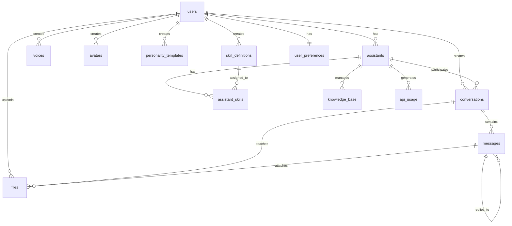

# AI秘書チーム・プラットフォーム - データベース設計

**作成日**: 2025年8月17日  
**作成者**: 中野五月（Claude Code）  
**バージョン**: 1.0

## 🗄️ データベース概要

### 技術スタック
- **データベース**: PostgreSQL 16
- **ベクトル拡張**: pgvector
- **ORM**: SQLAlchemy 2.0.23
- **マイグレーション**: Alembic 1.12.1
- **キャッシュ**: Redis 7

### 設計原則
- **正規化**: 第3正規形まで適用
- **パフォーマンス**: 適切なインデックス設計
- **拡張性**: 将来の機能追加に対応
- **データ整合性**: 外部キー制約とチェック制約

## 📊 テーブル設計

### 1. 基本テーブル

#### users（ユーザー）
```sql
CREATE TABLE users (
    id UUID PRIMARY KEY DEFAULT gen_random_uuid(),
    username VARCHAR(50) UNIQUE NOT NULL,
    email VARCHAR(255) UNIQUE NOT NULL,
    password_hash VARCHAR(255) NOT NULL,
    first_name VARCHAR(100),
    last_name VARCHAR(100),
    is_active BOOLEAN NOT NULL DEFAULT true,
    is_verified BOOLEAN NOT NULL DEFAULT false,
    last_login_at TIMESTAMP WITH TIME ZONE,
    created_at TIMESTAMP WITH TIME ZONE NOT NULL DEFAULT NOW(),
    updated_at TIMESTAMP WITH TIME ZONE NOT NULL DEFAULT NOW()
);

-- インデックス
CREATE INDEX idx_users_username ON users(username);
CREATE INDEX idx_users_email ON users(email);
CREATE INDEX idx_users_is_active ON users(is_active);
CREATE INDEX idx_users_created_at ON users(created_at);
```

#### assistants（AI秘書）
```sql
CREATE TABLE assistants (
    id UUID PRIMARY KEY DEFAULT gen_random_uuid(),
    user_id UUID NOT NULL REFERENCES users(id) ON DELETE CASCADE,
    name VARCHAR(100) NOT NULL,
    description TEXT,
    personality_template_id UUID,
    voice_id UUID,
    avatar_id UUID,
    default_llm_model VARCHAR(100) DEFAULT 'gemini-pro',
    custom_system_prompt TEXT,
    is_active BOOLEAN NOT NULL DEFAULT true,
    is_public BOOLEAN NOT NULL DEFAULT false,
    created_at TIMESTAMP WITH TIME ZONE NOT NULL DEFAULT NOW(),
    updated_at TIMESTAMP WITH TIME ZONE NOT NULL DEFAULT NOW()
);

-- インデックス
CREATE INDEX idx_assistants_user_id ON assistants(user_id);
CREATE INDEX idx_assistants_is_active ON assistants(is_active);
CREATE INDEX idx_assistants_is_public ON assistants(is_public);
CREATE INDEX idx_assistants_created_at ON assistants(created_at);
```

### 2. Phase 2拡張テーブル

#### skill_definitions（スキル定義）
```sql
CREATE TABLE skill_definitions (
    id UUID PRIMARY KEY DEFAULT gen_random_uuid(),
    user_id UUID REFERENCES users(id) ON DELETE CASCADE,
    skill_code VARCHAR(10) NOT NULL,
    name VARCHAR(100) NOT NULL,
    description TEXT NOT NULL,
    skill_type VARCHAR(50) NOT NULL,
    configuration JSONB NOT NULL,
    is_public BOOLEAN NOT NULL DEFAULT false,
    is_active BOOLEAN NOT NULL DEFAULT true,
    created_at TIMESTAMP WITH TIME ZONE NOT NULL DEFAULT NOW(),
    updated_at TIMESTAMP WITH TIME ZONE NOT NULL DEFAULT NOW()
);

-- インデックス
CREATE INDEX idx_skill_definitions_user_id ON skill_definitions(user_id);
CREATE INDEX idx_skill_definitions_skill_code ON skill_definitions(skill_code);
CREATE INDEX idx_skill_definitions_skill_type ON skill_definitions(skill_type);
CREATE INDEX idx_skill_definitions_is_active ON skill_definitions(is_active);
```

#### assistant_skills（アシスタントスキル関連）
```sql
CREATE TABLE assistant_skills (
    assistant_id UUID NOT NULL REFERENCES assistants(id) ON DELETE CASCADE,
    skill_definition_id UUID NOT NULL REFERENCES skill_definitions(id) ON DELETE CASCADE,
    is_enabled BOOLEAN NOT NULL DEFAULT true,
    priority INTEGER NOT NULL DEFAULT 1,
    custom_settings JSONB,
    created_at TIMESTAMP WITH TIME ZONE NOT NULL DEFAULT NOW(),
    updated_at TIMESTAMP WITH TIME ZONE NOT NULL DEFAULT NOW(),
    PRIMARY KEY (assistant_id, skill_definition_id)
);

-- インデックス
CREATE INDEX idx_assistant_skills_assistant_id ON assistant_skills(assistant_id);
CREATE INDEX idx_assistant_skills_skill_definition_id ON assistant_skills(skill_definition_id);
CREATE INDEX idx_assistant_skills_is_enabled ON assistant_skills(is_enabled);
CREATE INDEX idx_assistant_skills_priority ON assistant_skills(priority);
```

#### conversations（会話セッション）
```sql
CREATE TABLE conversations (
    id UUID PRIMARY KEY DEFAULT gen_random_uuid(),
    user_id UUID NOT NULL REFERENCES users(id) ON DELETE CASCADE,
    assistant_id UUID REFERENCES assistants(id),
    title VARCHAR(200),
    conversation_type VARCHAR(50),
    status VARCHAR(50),
    voice_enabled BOOLEAN DEFAULT false,
    voice_id UUID,
    metadata JSONB,
    started_at TIMESTAMP WITH TIME ZONE,
    ended_at TIMESTAMP WITH TIME ZONE,
    created_at TIMESTAMP WITH TIME ZONE NOT NULL DEFAULT NOW(),
    updated_at TIMESTAMP WITH TIME ZONE NOT NULL DEFAULT NOW()
);

-- インデックス
CREATE INDEX idx_conversations_user_id ON conversations(user_id);
CREATE INDEX idx_conversations_assistant_id ON conversations(assistant_id);
CREATE INDEX idx_conversations_status ON conversations(status);
CREATE INDEX idx_conversations_conversation_type ON conversations(conversation_type);
CREATE INDEX idx_conversations_created_at ON conversations(created_at);
```

#### messages（メッセージ履歴）
```sql
CREATE TABLE messages (
    id UUID PRIMARY KEY DEFAULT gen_random_uuid(),
    conversation_id UUID NOT NULL REFERENCES conversations(id) ON DELETE CASCADE,
    role VARCHAR(50) NOT NULL,
    content TEXT,
    content_type VARCHAR(50),
    parent_id UUID REFERENCES messages(id),
    metadata JSONB,
    created_at TIMESTAMP WITH TIME ZONE NOT NULL DEFAULT NOW()
);

-- インデックス
CREATE INDEX idx_messages_conversation_id ON messages(conversation_id);
CREATE INDEX idx_messages_role ON messages(role);
CREATE INDEX idx_messages_parent_id ON messages(parent_id);
CREATE INDEX idx_messages_created_at ON messages(created_at);
```

### 3. コンポーネント管理テーブル

#### voices（音声設定）
```sql
CREATE TABLE voices (
    id UUID PRIMARY KEY DEFAULT gen_random_uuid(),
    user_id UUID REFERENCES users(id) ON DELETE CASCADE,
    name VARCHAR(100) NOT NULL,
    provider VARCHAR(50),
    voice_id VARCHAR(100),
    language VARCHAR(10),
    gender VARCHAR(20),
    age_group VARCHAR(20),
    description TEXT,
    sample_url VARCHAR(500),
    settings JSONB,
    is_active BOOLEAN DEFAULT true,
    is_public BOOLEAN DEFAULT false,
    created_at TIMESTAMP WITH TIME ZONE NOT NULL DEFAULT NOW(),
    updated_at TIMESTAMP WITH TIME ZONE NOT NULL DEFAULT NOW()
);

-- インデックス
CREATE INDEX idx_voices_user_id ON voices(user_id);
CREATE INDEX idx_voices_provider ON voices(provider);
CREATE INDEX idx_voices_language ON voices(language);
CREATE INDEX idx_voices_is_active ON voices(is_active);
```

#### avatars（アバター設定）
```sql
CREATE TABLE avatars (
    id UUID PRIMARY KEY DEFAULT gen_random_uuid(),
    user_id UUID REFERENCES users(id) ON DELETE CASCADE,
    name VARCHAR(100) NOT NULL,
    avatar_type VARCHAR(50),
    image_url VARCHAR(500),
    animated_url VARCHAR(500),
    style VARCHAR(50),
    gender VARCHAR(20),
    age_appearance VARCHAR(20),
    tags TEXT[],
    metadata JSONB,
    is_active BOOLEAN DEFAULT true,
    is_public BOOLEAN DEFAULT false,
    created_at TIMESTAMP WITH TIME ZONE NOT NULL DEFAULT NOW(),
    updated_at TIMESTAMP WITH TIME ZONE NOT NULL DEFAULT NOW()
);

-- インデックス
CREATE INDEX idx_avatars_user_id ON avatars(user_id);
CREATE INDEX idx_avatars_avatar_type ON avatars(avatar_type);
CREATE INDEX idx_avatars_style ON avatars(style);
CREATE INDEX idx_avatars_is_active ON avatars(is_active);
CREATE INDEX idx_avatars_tags ON avatars USING GIN(tags);
```

#### personality_templates（パーソナリティテンプレート）
```sql
CREATE TABLE personality_templates (
    id UUID PRIMARY KEY DEFAULT gen_random_uuid(),
    user_id UUID REFERENCES users(id) ON DELETE CASCADE,
    name VARCHAR(100) NOT NULL,
    description TEXT,
    template_type VARCHAR(50),
    system_prompt TEXT,
    parameters JSONB,
    is_active BOOLEAN DEFAULT true,
    is_public BOOLEAN DEFAULT false,
    created_at TIMESTAMP WITH TIME ZONE NOT NULL DEFAULT NOW(),
    updated_at TIMESTAMP WITH TIME ZONE NOT NULL DEFAULT NOW()
);

-- インデックス
CREATE INDEX idx_personality_templates_user_id ON personality_templates(user_id);
CREATE INDEX idx_personality_templates_template_type ON personality_templates(template_type);
CREATE INDEX idx_personality_templates_is_active ON personality_templates(is_active);
```

### 4. ファイル管理テーブル

#### files（ファイル管理）
```sql
CREATE TABLE files (
    id UUID PRIMARY KEY DEFAULT gen_random_uuid(),
    user_id UUID NOT NULL REFERENCES users(id) ON DELETE CASCADE,
    conversation_id UUID REFERENCES conversations(id),
    message_id UUID REFERENCES messages(id),
    file_name VARCHAR(255) NOT NULL,
    file_type VARCHAR(100),
    file_size INTEGER,
    storage_path VARCHAR(500),
    mime_type VARCHAR(100),
    is_processed BOOLEAN DEFAULT false,
    metadata JSONB,
    created_at TIMESTAMP WITH TIME ZONE NOT NULL DEFAULT NOW(),
    updated_at TIMESTAMP WITH TIME ZONE NOT NULL DEFAULT NOW()
);

-- インデックス
CREATE INDEX idx_files_user_id ON files(user_id);
CREATE INDEX idx_files_conversation_id ON files(conversation_id);
CREATE INDEX idx_files_message_id ON files(message_id);
CREATE INDEX idx_files_file_type ON files(file_type);
CREATE INDEX idx_files_is_processed ON files(is_processed);
```

### 5. 知識管理テーブル

#### knowledge_base（知識ベース）
```sql
CREATE TABLE knowledge_base (
    id UUID PRIMARY KEY DEFAULT gen_random_uuid(),
    secretary_id UUID REFERENCES assistants(id),
    content TEXT NOT NULL,
    embedding VECTOR(1536),  -- pgvector拡張使用
    source_type VARCHAR(50),
    source_url VARCHAR(500),
    tags TEXT[],
    metadata JSONB,
    created_at TIMESTAMP WITH TIME ZONE NOT NULL DEFAULT NOW(),
    updated_at TIMESTAMP WITH TIME ZONE NOT NULL DEFAULT NOW()
);

-- インデックス
CREATE INDEX idx_knowledge_base_secretary_id ON knowledge_base(secretary_id);
CREATE INDEX idx_knowledge_base_source_type ON knowledge_base(source_type);
CREATE INDEX idx_knowledge_base_tags ON knowledge_base USING GIN(tags);
CREATE INDEX idx_knowledge_base_embedding ON knowledge_base USING ivfflat (embedding vector_cosine_ops);
```

### 6. システム管理テーブル

#### user_preferences（ユーザー設定）
```sql
CREATE TABLE user_preferences (
    user_id UUID PRIMARY KEY REFERENCES users(id) ON DELETE CASCADE,
    theme VARCHAR(50),
    language VARCHAR(10),
    timezone VARCHAR(50),
    notification_settings JSONB,
    privacy_settings JSONB,
    default_assistant_id UUID REFERENCES assistants(id),
    created_at TIMESTAMP WITH TIME ZONE NOT NULL DEFAULT NOW(),
    updated_at TIMESTAMP WITH TIME ZONE NOT NULL DEFAULT NOW()
);
```

#### system_settings（システム設定）
```sql
CREATE TABLE system_settings (
    id UUID PRIMARY KEY DEFAULT gen_random_uuid(),
    key VARCHAR(255) UNIQUE NOT NULL,
    value JSONB NOT NULL,
    description TEXT,
    updated_at TIMESTAMP WITH TIME ZONE NOT NULL DEFAULT NOW()
);

-- インデックス
CREATE INDEX idx_system_settings_key ON system_settings(key);
```

#### api_usage（API使用履歴）
```sql
CREATE TABLE api_usage (
    id UUID PRIMARY KEY DEFAULT gen_random_uuid(),
    secretary_id UUID REFERENCES assistants(id),
    api_name VARCHAR(100) NOT NULL,
    tokens_used INTEGER,
    cost DECIMAL(10, 4),
    response_time_ms INTEGER,
    success BOOLEAN NOT NULL DEFAULT true,
    error_message TEXT,
    metadata JSONB,
    created_at TIMESTAMP WITH TIME ZONE NOT NULL DEFAULT NOW()
);

-- インデックス
CREATE INDEX idx_api_usage_secretary_id ON api_usage(secretary_id);
CREATE INDEX idx_api_usage_api_name ON api_usage(api_name);
CREATE INDEX idx_api_usage_created_at ON api_usage(created_at);
CREATE INDEX idx_api_usage_success ON api_usage(success);
```

## 🔗 リレーションシップ

### 主要な関係


## 📈 パフォーマンス最適化

### 1. インデックス戦略

#### 複合インデックス
```sql
-- 会話検索用
CREATE INDEX idx_conversations_user_status_created 
ON conversations(user_id, status, created_at DESC);

-- メッセージ検索用
CREATE INDEX idx_messages_conversation_created 
ON messages(conversation_id, created_at DESC);

-- アシスタント検索用
CREATE INDEX idx_assistants_user_active_created 
ON assistants(user_id, is_active, created_at DESC);
```

#### 部分インデックス
```sql
-- アクティブなアシスタントのみ
CREATE INDEX idx_assistants_active 
ON assistants(user_id, name) 
WHERE is_active = true;

-- 未処理のファイルのみ
CREATE INDEX idx_files_unprocessed 
ON files(user_id, created_at) 
WHERE is_processed = false;
```

### 2. パーティショニング

```sql
-- メッセージテーブルの月次パーティショニング
CREATE TABLE messages_y2024m01 PARTITION OF messages
FOR VALUES FROM ('2024-01-01') TO ('2024-02-01');

CREATE TABLE messages_y2024m02 PARTITION OF messages
FOR VALUES FROM ('2024-02-01') TO ('2024-03-01');
```

### 3. ビュー定義

```sql
-- アクティブなアシスタント情報ビュー
CREATE VIEW active_assistants AS
SELECT 
    a.id,
    a.name,
    a.description,
    a.default_llm_model,
    u.username as owner_username,
    COUNT(c.id) as conversation_count,
    MAX(c.created_at) as last_conversation_at
FROM assistants a
JOIN users u ON a.user_id = u.id
LEFT JOIN conversations c ON a.id = c.assistant_id
WHERE a.is_active = true
GROUP BY a.id, a.name, a.description, a.default_llm_model, u.username;

-- 会話統計ビュー
CREATE VIEW conversation_stats AS
SELECT 
    c.id,
    c.title,
    c.status,
    a.name as assistant_name,
    u.username as user_name,
    COUNT(m.id) as message_count,
    MIN(m.created_at) as first_message_at,
    MAX(m.created_at) as last_message_at
FROM conversations c
JOIN users u ON c.user_id = u.id
LEFT JOIN assistants a ON c.assistant_id = a.id
LEFT JOIN messages m ON c.id = m.conversation_id
GROUP BY c.id, c.title, c.status, a.name, u.username;
```

## 🔒 セキュリティ

### 1. 行レベルセキュリティ（RLS）

```sql
-- ユーザーは自分のデータのみアクセス可能
ALTER TABLE assistants ENABLE ROW LEVEL SECURITY;
ALTER TABLE conversations ENABLE ROW LEVEL SECURITY;
ALTER TABLE messages ENABLE ROW LEVEL SECURITY;
ALTER TABLE files ENABLE ROW LEVEL SECURITY;

-- ポリシー定義
CREATE POLICY user_assistants_policy ON assistants
    FOR ALL TO authenticated
    USING (user_id = current_user_id());

CREATE POLICY user_conversations_policy ON conversations
    FOR ALL TO authenticated
    USING (user_id = current_user_id());
```

### 2. データ暗号化

```sql
-- 機密データの暗号化
CREATE EXTENSION IF NOT EXISTS pgcrypto;

-- パスワードハッシュ化関数
CREATE OR REPLACE FUNCTION hash_password(password TEXT)
RETURNS TEXT AS $$
BEGIN
    RETURN crypt(password, gen_salt('bf'));
END;
$$ LANGUAGE plpgsql;

-- パスワード検証関数
CREATE OR REPLACE FUNCTION verify_password(password TEXT, hash TEXT)
RETURNS BOOLEAN AS $$
BEGIN
    RETURN hash = crypt(password, hash);
END;
$$ LANGUAGE plpgsql;
```

## 🔄 マイグレーション

### 1. Alembic設定

```python
# alembic/env.py
from sqlalchemy import engine_from_config, pool
from alembic import context
from app.models.models import Base
from app.core.config import settings

config = context.config
config.set_main_option("sqlalchemy.url", settings.database_url)

target_metadata = Base.metadata

def run_migrations_offline():
    url = config.get_main_option("sqlalchemy.url")
    context.configure(
        url=url,
        target_metadata=target_metadata,
        literal_binds=True,
        dialect_opts={"paramstyle": "named"},
    )

    with context.begin_transaction():
        context.run_migrations()

def run_migrations_online():
    connectable = engine_from_config(
        config.get_section(config.config_ini_section),
        prefix="sqlalchemy.",
        poolclass=pool.NullPool,
    )

    with connectable.connect() as connection:
        context.configure(
            connection=connection, target_metadata=target_metadata
        )

        with context.begin_transaction():
            context.run_migrations()

if context.is_offline_mode():
    run_migrations_offline()
else:
    run_migrations_online()
```

### 2. 初期データ投入

```sql
-- 初期ユーザー作成
INSERT INTO users (username, email, password_hash, first_name, last_name, is_verified)
VALUES ('admin', 'admin@ai-secretary.local', hash_password('admin123'), 'Admin', 'User', true);

-- システム設定の初期化
INSERT INTO system_settings (key, value, description) VALUES
('app_version', '"1.0.0"', 'アプリケーションバージョン'),
('max_file_size', '10485760', '最大ファイルサイズ（バイト）'),
('supported_file_types', '["pdf", "txt", "docx", "md"]', 'サポートされるファイルタイプ'),
('default_llm_model', '"gemini-pro"', 'デフォルトLLMモデル');
```

## 📊 監視・メンテナンス

### 1. 統計情報収集

```sql
-- テーブルサイズ監視
SELECT 
    schemaname,
    tablename,
    pg_size_pretty(pg_total_relation_size(schemaname||'.'||tablename)) as size
FROM pg_tables 
WHERE schemaname = 'public'
ORDER BY pg_total_relation_size(schemaname||'.'||tablename) DESC;

-- インデックス使用状況
SELECT 
    schemaname,
    tablename,
    indexname,
    idx_scan,
    idx_tup_read,
    idx_tup_fetch
FROM pg_stat_user_indexes
ORDER BY idx_scan DESC;
```

### 2. クリーンアップ処理

```sql
-- 古いメッセージのアーカイブ
CREATE OR REPLACE FUNCTION archive_old_messages()
RETURNS INTEGER AS $$
DECLARE
    archived_count INTEGER;
BEGIN
    -- 6ヶ月以上古いメッセージをアーカイブテーブルに移動
    WITH moved_messages AS (
        DELETE FROM messages 
        WHERE created_at < NOW() - INTERVAL '6 months'
        RETURNING *
    )
    INSERT INTO messages_archive SELECT * FROM moved_messages;
    
    GET DIAGNOSTICS archived_count = ROW_COUNT;
    RETURN archived_count;
END;
$$ LANGUAGE plpgsql;

-- 定期的なクリーンアップ（cron等で実行）
SELECT archive_old_messages();
```

## 🚀 本番環境設定

### 1. 接続プール設定

```python
# 本番環境用のデータベース設定
DATABASE_CONFIG = {
    "pool_size": 20,
    "max_overflow": 30,
    "pool_pre_ping": True,
    "pool_recycle": 3600,
    "echo": False,
    "connect_args": {
        "server_settings": {
            "application_name": "ai_secretary_platform",
            "timezone": "UTC"
        }
    }
}
```

### 2. バックアップ戦略

```bash
#!/bin/bash
# データベースバックアップスクリプト

BACKUP_DIR="/backups/postgresql"
DATE=$(date +%Y%m%d_%H%M%S)
DB_NAME="ai_secretary"

# フルバックアップ
pg_dump -h localhost -U ai_secretary_user -d $DB_NAME \
    --format=custom --compress=9 \
    --file="$BACKUP_DIR/ai_secretary_$DATE.dump"

# 古いバックアップの削除（30日以上古いもの）
find $BACKUP_DIR -name "*.dump" -mtime +30 -delete
```

このデータベース設計により、AI秘書チーム・プラットフォームの要件を満たしつつ、将来の拡張性とパフォーマンスを確保できます。
